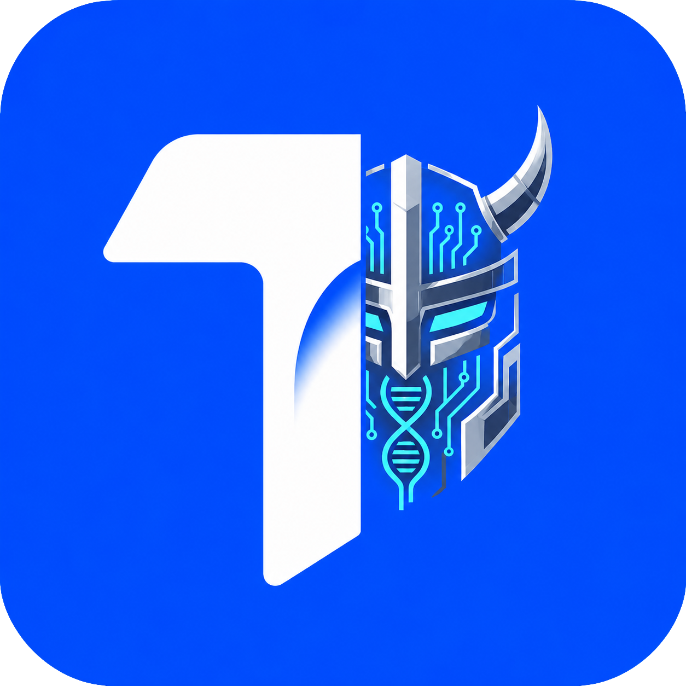

# TEDI RTK Bridge

Routes the built-in AI agent's shell tools in [TEDI](https://github.com/IlhamriSKY/TEDI)
through [RTK](https://github.com/rtk-ai/rtk), the Rust Token Killer
proxy. RTK filters and compresses common dev-tool output (git, npm,
docker) before it reaches the AI, saving **60-90% of tokens** on shell
operations.

<p align="center">
  
</p>

> [!NOTE]
> RTK is **not** bundled with this extension. Install RTK separately
> and put `rtk` on your `PATH`. The extension probes for it at
> activate; if missing the bridge stays inactive.

---

## Install

1. Open **Settings → Extensions** in TEDI.
2. Switch to the **From GitHub** tab.
3. Paste `IlhamriSKY/TEDI.rtk-bridge` and click **Review → Install**.

## Update

In **Settings → Extensions**, click **Check updates** on this extension's
card. If a new release exists, click **Update** to reinstall in place.

## How it works

```
TEDI AI agent
    │
    │ tool: bash_run({ command: "git status" })
    ▼
applyShellTransformers(cmd, "bash")
    │
    │ this extension's transformer prefixes "rtk "
    ▼
rtk git status   →   git status   →   compressed output   →   AI
```

On activate:

1. Runs `rtk --version` once to confirm RTK is on `PATH`.
2. If present, registers a `ctx.shell.registerCommandTransformer`
   that wraps every AI-issued shell command with `rtk `.
3. Shows a one-time onboarding toast (latched so it never repeats on
   the same machine).

On disable / uninstall, the transformer is dropped and TEDI's shell
tools go back to running commands raw. No core TEDI code is
RTK-aware.

## Permissions

| Permission | Why |
| --- | --- |
| `ui:toast` | Onboarding toast on first RTK detect. |
| `shell:transform` | Rewrite every AI shell command. **High risk** — the extension chooses what runs. |
| `invoke:shell_run_command` | Run `rtk --version` once per activate. |

No filesystem, no keychain, no network. RTK itself is invoked over
local shell only.

## Development

```bash
git clone https://github.com/IlhamriSKY/TEDI.rtk-bridge.git
cd TEDI.rtk-bridge

# Package + install via Settings → Extensions → From file:
zip dev.zip manifest.json extension.js logo.png README.md LICENSE
```

To cut a release, tag `vX.Y.Z` and push. The CI in
[`.github/workflows/release.yml`](.github/workflows/release.yml) builds
the release zip and creates the GitHub release.

Make sure RTK is on the PATH that non-interactive shells inherit
(`.profile` / `.zprofile` on Unix, `%PATH%` env var on Windows) — TEDI
spawns shells without your interactive rc files.
