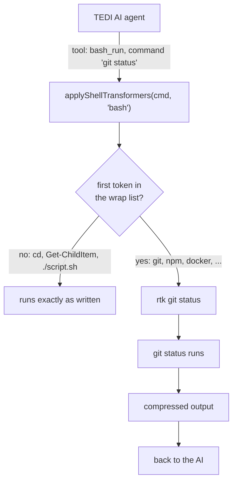

# TEDI RTK Bridge

Routes the built-in AI agent's shell tools in [TEDI](https://tedi.ilhamriski.com/)
through [RTK](https://github.com/rtk-ai/rtk), the Rust Token Killer proxy. RTK
filters and compresses common dev-tool output (git, npm, docker) before it
reaches the AI, saving 60-90% of tokens on shell operations.

<p align="center">
  
</p>

> [!NOTE]
> RTK is **not** bundled with this extension. Install RTK separately and put
> `rtk` on the `PATH` that non-interactive shells inherit (`.profile` /
> `.zprofile` on Unix, the `%PATH%` env var on Windows), because TEDI spawns
> shells without your interactive rc files. The extension probes for `rtk` at
> activate; if it is missing, the bridge stays inactive.

---

## Install

1. Open **Settings → Extensions** in TEDI.
2. Switch to the **From GitHub** tab.
3. Paste `IlhamriSKY/TEDI.rtk-bridge` and click **Review → Install**.

## Update

In **Settings → Extensions**, click **Check updates** on this extension's
card. If a new release exists, click **Update** to reinstall in place.

## How it works



On activate:

1. Runs `rtk --version` once to confirm RTK is on `PATH`.
2. If present, reads the active workspace's `.tedi/rtk.json` (if any), then
   registers a `ctx.shell.registerCommandTransformer` that prefixes the
   AI-issued commands RTK actually filters.
3. Re-reads the config whenever the active workspace changes.
4. Shows a one-time onboarding toast (latched so it never repeats on the same
   machine).

On disable or uninstall, the transformer and the workspace subscription are
dropped and TEDI's shell tools go back to running commands raw. No core TEDI
code is RTK-aware.

### Why only some commands

`rtk <name>` resolves `<name>` on `PATH`. Anything that is not a file on `PATH`
prints `[rtk: program not found]` and then **exits 0**:

```console
$ rtk cd sub
rtk: Failed to resolve 'cd' via PATH, falling back to direct exec: Binary 'cd' not found on PATH
[rtk: program not found]
$ echo $?
0
```

That covers every shell builtin (`cd`, `export`, `source`, `set`), every
PowerShell cmdlet - which is most of what runs on Windows, where TEDI's AI
shell *is* PowerShell - and every user-defined function or alias. Wrapping all
of them turned `cd build && cmake ..` into a silent no-op that reported
success. No skip-list is long enough to cover that, and RTK only ships filters
for a known set of tools anyway, so the default is that set: git, gh, glab, gt,
npm, npx, pnpm, cargo, go, pip, dotnet, mvn, gradlew, docker, kubectl, oc, aws,
psql, tsc, next, prisma, rake, jest, vitest, playwright, pytest, rspec,
prettier, ruff, mypy, rubocop, golangci-lint, grep, rg, find, tree, curl, wget.

Names that collide with a POSIX builtin (`test`, `read`, `env`, `wc`) are left
out on purpose even though RTK has a verb for them, because `test -f x` and
`rtk test` are not the same command.

The same trap fires for a listed tool you simply do not have - `rtk oc version`
on a machine with no `oc` also prints `[rtk: program not found]` and exits 0 -
so activate runs one more probe (`where.exe <names>` on Windows,
`command -v <names>` elsewhere; neither needs shell syntax, so the same call
works under sh, bash, zsh, PowerShell and cmd) and drops everything that is not
on `PATH`.

Multi-name lookup is an extension in every shell that has it, so the probe ends
with a canary: `rtk` itself, which `rtk --version` just proved is on `PATH`. If
the canary comes back, the shell read the whole argument list and the answer can
be trusted. If it does not, the answer is partial and is thrown away rather than
read as "these tools are missing", which would have quietly stopped RTK wrapping
almost everything. A tool you name yourself in `wrap` is trusted without a probe
hit, and the log line at startup says exactly which tools ended up routed.

## Knowing it is on

The bridge used to be invisible, which meant TEDI's own AI had to go and
discover it: asked whether it could use RTK, it grepped the repo and read two
READMEs before answering. Two things fix that.

- A **status-bar badge** with the number of routed commands. Its tooltip lists
  them, names the prefix, and says whether the `PATH` probe narrowed the set. It
  turns grey when a project has wrapping switched off, and it is absent entirely
  when RTK is not installed.
- An **`rtk_status` tool** contributed to the agent. Its description is in the
  model's tool list every turn, so the agent knows RTK is active and that
  commands are already prefixed - it should never type `rtk` itself. Calling the
  tool returns the exact routed list and where the configuration came from.

> [!NOTE]
> The badge needs the `statusbar:write` permission, added in 0.4.1. Updating
> from an earlier version shows it in the install review dialog as a newly
> requested permission; approve it to turn the badge on. Command routing works
> either way.

## Configuration

Settings are per project, in `<workspace>/.tedi/rtk.json` (the same `.tedi/`
folder TEDI uses for memory and skills). Every key is optional:

```jsonc
{
  "enabled": true,          // false turns RTK off for this project
  "command": "rtk",         // the prefix / binary to route through
  "wrap": ["terraform"],    // extra commands to route through RTK
  "skip": ["docker"]        // commands to leave alone
}
```

- With **no** `.tedi/rtk.json`, the default list above applies, so RTK works out
  of the box once installed.
- `wrap` adds to that list, `skip` removes from it. RTK falls back to raw
  passthrough plus tracking for a command it has no filter for, so adding your
  own tools is safe as long as they are real executables.
- The configured `command` is always skipped implicitly, so a meta call like
  `rtk gain` is never double-wrapped.
- `command` must be a bare program name or a space-free path. Anything else - a
  pipeline, a quoted path, a `;` - is refused, wrapping is disabled for that
  project, and a toast explains why. The value is concatenated into the command
  string the shell runs, and a `.tedi/` folder can arrive with a cloned repo.
- The file is read at activate and re-read on workspace switch. After editing
  it in the open project, toggle the extension off / on (or reopen the
  workspace) to pick up the change.

## Permissions

| Permission | Why |
| --- | --- |
| `ui:toast` | Onboarding toast on first RTK detect. |
| `statusbar:write` | The badge showing how many commands are routed. |
| `shell:transform` | Rewrite AI shell commands. **High risk:** the extension chooses what runs. |
| `invoke:shell_run_command` | Run `rtk --version` and one `PATH` probe, once per activate. |
| `invoke:fs_read_file` | Read `<workspace>/.tedi/rtk.json` for per-project settings. |

Reads only `<workspace>/.tedi/rtk.json`. No keychain, no network. RTK itself is
invoked over local shell only.

## Development

```bash
git clone https://github.com/IlhamriSKY/TEDI.rtk-bridge.git
cd TEDI.rtk-bridge

# Build extension.js from src/ (generated by esbuild, not committed).
npm install
npm run build

# Two runnable checks: the rewrite decision (pure), and the built bundle
# driven through the host contract with a fake ctx.
npm run verify
npm run typecheck

# Package, then install via Settings → Extensions → From file:
zip dev.zip manifest.json extension.js logo.png README.md CHANGELOG.md LICENSE
```

To cut a release, tag `vX.Y.Z` and push. CI in
[`.github/workflows/release.yml`](.github/workflows/release.yml) builds the
release zip and creates the GitHub release.
